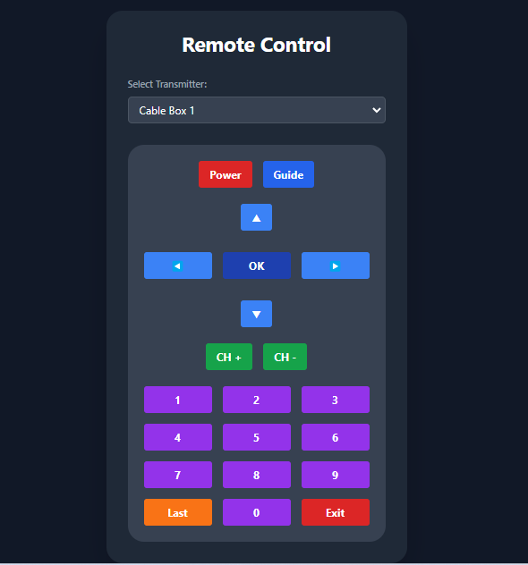

# Just Add Power IR Blaster Web Interface

## Table of Contents
1. [Introduction](#introduction)
2. [System Overview](#system-overview)
3. [Features](#features)
4. [Requirements](#requirements)
5. [Installation](#installation)
6. [Configuration](#configuration)
7. [Usage](#usage)
8. [Customization](#customization)
9. [Troubleshooting](#troubleshooting)
10. [Contributing](#contributing)

## Introduction

This project provides a web-based interface for controlling multiple Just Add Power 3G transmitters with V2 Flux Capacitor IR dongles. It's designed to allow remote control of cable boxes, TVs, or other IR-controlled devices through a network connection.

The interface mimics a standard remote control, with customizable IR codes to suit various devices. By default, it's configured for Samsung/Scientific Atlanta cable boxes, but can be easily adapted for other devices.

## System Overview

The system consists of the following components:

1. **Web Interface**: A responsive HTML/JavaScript frontend that provides a user-friendly remote control interface.
2. **PHP Backend**: Handles API requests and communicates with the IR blaster devices.
3. **Just Add Power 3G Transmitters**: Network-connected devices that send the IR signals.
4. **V2 Flux Capacitor IR Dongles**: Attached to the transmitters, these emit the actual IR signals.
5. **Target Devices**: Cable boxes, TVs, or other IR-controlled devices that receive the signals.

## Features

- Responsive web interface accessible from any device with a web browser
- Support for multiple transmitters/IR blasters
- Customizable IR codes for different devices
- Easy-to-use remote control layout
- Error handling and user feedback

## Requirements

- Web server with PHP support (e.g., Apache, Nginx)
- Just Add Power 3G transmitters with V2 Flux Capacitor IR dongles
- Network connectivity to the transmitters
- Devices to be controlled (e.g., cable boxes, TVs)

## Installation

1. Clone this repository to your web server's document root:
   ```
   git clone https://github.com/yourusername/jap-ir-blaster.git
   ```

2. Ensure the web server has read access to all files and write access to the `transmitters.txt` and `payloads.txt` files.

3. Configure your web server to serve the project directory.

## Configuration

### Transmitters

Edit the `transmitters.txt` file to add your Just Add Power 3G transmitters. Each line should contain a name and IP address, separated by a comma:

```
Living Room,http://192.168.1.100
Bedroom,http://192.168.1.101
Den,http://192.168.1.102
```

### IR Codes

The `payloads.txt` file contains the IR codes for each button. Each line should have the format:

```
button_name=IR_code
```

For example:
```
power=sendir,1:1,1,38000,1,69,340,170,21,21,21,21,21,64,21,21,21,21,21,21,21,21,21,21,21,64,21,64,21,21,21,64,21,64,21,64,21,64,21,64,21,21,21,21,21,64,21,21,21,21,21,21,21,21,21,21,21,64,21,64,21,21,21,64,21,64,21,64,21,64,21,64,21,1517,340,85,21,3647
```

Modify these codes to match your specific devices. You can usually find IR codes for various devices online or by using an IR learning remote.

## Usage

1. Access the web interface by navigating to the project URL in a web browser.

2. Select the desired transmitter from the dropdown menu.

3. Use the on-screen remote control buttons to send commands to your devices.

## Customization

### Adding New Buttons

To add new buttons to the interface:

1. Add the button to the HTML in `index.html`.
2. Add the corresponding IR code to `payloads.txt`.
3. Ensure the `onclick` attribute of the new button calls `sendCommand()` with the correct action name.

### Changing Button Colors

Modify the Tailwind CSS classes in `index.html` to change button colors. For example, to change a button to green:

```html
<button class="bg-green-600 hover:bg-green-700 text-white font-bold py-2 px-4 rounded" onclick="sendCommand('action')">Button</button>
```

## Troubleshooting

- **Transmitter not responding**: Ensure the IP address is correct in `transmitters.txt` and the transmitter is powered on and connected to the network.
- **IR commands not working**: Verify the IR codes in `payloads.txt` are correct for your device. Try adjusting the position of the IR dongle for better line-of-sight to the target device.
- **Web interface not loading**: Check your web server configuration and ensure PHP is properly installed and configured.

## Contributing

Contributions to this project are welcome! Please fork the repository and submit a pull request with your changes.

---

This project is not officially affiliated with or endorsed by Just Add Power. Use at your own risk.
